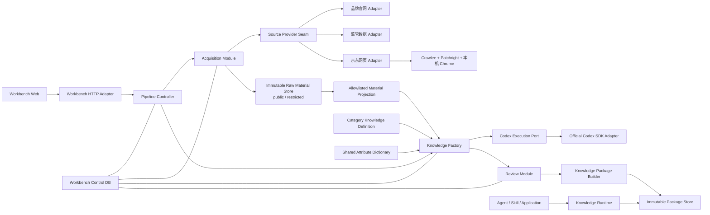

# Agent 知识生产平台工程架构基线

状态：提议基线，等待阶段 1 原型验证后冻结
版本：V0.2
更新日期：2026-08-14

## 1. 文档职责

本文把产品需求转换为工程模块、interface、依赖方向、数据分区和现有项目复用策略。

本文不冻结具体函数签名、数据库表、目录格式、队列算法或最终开源组件。技术候选必须先进入 `RESEARCH.md` 并通过原型验证。

## 2. 架构结论

继续在当前 TypeScript npm-workspaces 仓库上演进，采用“模块化单体 Workbench＋独立只读 Runtime”的形态，不新建仓库，不在 MVP 阶段拆微服务。

Workbench 负责知识生产，Runtime 负责知识消费。两者使用相同的知识包语义，但 Runtime 不依赖 Workbench 控制库、浏览器、模型或加工 Worker。

商品领域采用“一套稳定商品知识模型＋共享属性字典＋数据化品类知识定义”。冰箱、电视等品类不能成为新的生产 Schema 或模块；品类切换只更换版本化定义数据、官方来源范围和评测集。

本地 Workbench Web 是日常产品入口：Codex 提供引导式澄清和候选生成，结构化页面负责回顾、例外审核、恢复、版本差异和发布。CLI 只承担开发、诊断和自动化，不另建一套用户工作流。

来源和知识层按变化速度使用版本化更新策略；变化检测只产生新快照、新候选知识和新包版本，不覆盖历史。Runtime 按精确匹配、结构化筛选、全文检索、关系导航、证据/质量状态的顺序查询；向量或语义检索不是 MVP 必需依赖。

## 3. 当前仓库真实能力

当前 `master` 提供：

- npm workspaces TypeScript monorepo；
- Fastify 本地 HTTP 服务；
- React/Vite/TanStack Query 工作台；
- Zod 契约；
- Drizzle＋SQLite/libSQL 持久化；
- Crawlee、`p-queue` 和 Reddit/X 采集示例；
- Project、Run、Task、Collection Plan 和 Raw Content 的基础控制面；
- Vitest 测试框架和一批 repository/route/client 测试。

当前没有真实完成：

- 正式 Provider、京东网页采集的白名单字段投影与批量稳定性验证；
- 原始 HTML、截图、图片和字段证据的实际保存；
- 可恢复的多阶段知识生产流水线；
- 规则、Codex 和人工审核闭环；
- Codex SDK 知识加工 adapter 及其业务 contract、超时、取消和失败恢复；
- 稳定商品知识 Schema 与数据化品类定义；
- 知识包构建、校验、发布和版本生命周期；
- 独立 Runtime 和 Agent 查询演示。

## 4. 现有资产处置矩阵

| 现有资产 | 处置 | 原因和目标形态 |
| --- | --- | --- |
| npm workspaces、TypeScript、根构建脚本 | 保留 | 工程底盘稳定，继续统一依赖、构建和类型检查 |
| Fastify 启动、路由注册、统一错误处理 | 保留并按模块拆分 | 作为 Workbench 的 HTTP adapter，不承载领域状态推导 |
| React/Vite/TanStack Query、AppShell、分页 | 保留 | 替换业务页面和 contract，不重写通用 UI 基础 |
| `packages/shared` 的 Zod 使用方式 | 保留方法，重建内容 | 继续作为跨进程 typed contract 权威源，移除 Reddit/Social 语义 |
| Drizzle＋SQLite/libSQL | 保留为 Workbench 控制库候选 | 需要正式 migration，不能继续手写重复 DDL |
| repository 注入和内存 SQLite 测试方式 | 保留 | 作为本地可替代依赖，通过 module interface 测试 |
| Crawlee 与保守采集策略 | 保留为获准网页来源候选 | 必须先证明来源授权，不代表现有 adapter 可复用 |
| `BrowserRuntimeConfig` 的人工挑战禁止规则 | 保留停止约束，重做边界 | 人工接管不能把未获授权的网页自动化变成合规入口 |
| `AnalysisProject` | 重构为 `ProductKnowledgeProject` | 围绕品类知识资产维护市场、品类定义和已确认范围，不绑定单一 Agent |
| `CollectionPlan` | 重构为 `CollectionBoardVersion` | 从关键词计划变为 Provider＋范围矩阵＋更新策略 |
| `AnalysisRun` | 替换为 `PipelineRun` | 冻结输入版本，分离阶段、生命周期和人工介入 |
| `CrawlTask` | 替换为 `StageExecution` / `TaskAttempt` | 支持幂等、恢复、重试历史和明确失败分类 |
| `RawContent` | 拆分 | 拆成 `SourceObject`、`CaptureSnapshot`、原始资源和 `EvidenceReference` |
| `cleaned_contents` / `analyzed_contents` | 淘汰出新主流程 | 替换为候选知识、知识结论、处理版本和审核决定 |
| `reports` 和 deterministic 社交报告 | 淘汰出新主流程 | 替换为评测结果、候选知识包和发布信息 |
| 进程内 `TaskQueue` 与 `setInterval` scheduler | 不作为正式编排器 | 无法满足崩溃恢复、长等待和人工信号；选型进入调研门 |
| Reddit/X adapter 和 Social Intelligence UI | 不进入新主流程 | 仅作 adapter/测试组织参考，不作为京东或知识平台语义 |
| 未合并远程分支的浏览器/恢复代码 | 只读参考 | 不整体合并；逐项验证后提取可复用模式和测试 |
| 未合并分支的 `AiInsightAnalyzer`、批处理与证据校验 | 提取 interface 和处理模式 | 该分支实际依赖 Vercel AI SDK 与 API Key；不直接合并 Provider 实现，改为官方 Codex SDK adapter |
| 未合并分支的 `externalCollector` 子进程封装 | 不复用进程实现，仅参考错误分类需求 | 官方 Codex SDK 已负责 CLI 进程、JSONL 事件和线程恢复；项目不重复实现 |

## 5. 目标 Module 与 Interface

### 5.1 Project Module

负责商品知识项目、品类知识定义、用途说明和已确认范围的版本生命周期。

外部 interface 只暴露创建、修订、确认、归档和读取已冻结版本；不暴露数据库表或页面表单形状。

`ProductKnowledgeModel` 是所有商品共用的稳定领域语义；`CategoryKnowledgeDefinition` 是版本化数据。新增品类不得要求修改领域 interface、迁移数据库或增加品类子类。

### 5.2 Pipeline Module

负责一次流水线运行的阶段推进、生命周期、重试、取消和人工介入。

目标 interface：

- 启动一个已冻结输入的运行；
- 对运行发送暂停、恢复、取消、阶段重试和人工处理命令；
- 查询运行、阶段、任务尝试和待人工事项；
- 返回 typed 状态，不要求调用方理解内部编排器。

编排器是该 module 的实现细节，最终选型必须通过调研与恢复原型验证。

### 5.3 Acquisition Module

负责数据搜集板块执行、范围覆盖、来源对象发现、采集快照提交和来源状态归一化。

`SourceProvider` seam 隔离外部来源差异。Provider adapter 不直接写 Workbench 领域表，不形成最终知识，也不暴露 Playwright Page 给上层。

首轮来源由权威来源策略限制为品牌官网/说明书、平台官方自营/经核实官方旗舰店和监管/标准来源。普通第三方商家不进入事实层。每个数据搜集板块必须冻结来源策略、用途、访问方式、敏感数据边界和停止条件。京东按 ADR-0004 使用 Crawlee＋Patchright、本机 Chrome 和专用 Profile；同一 adapter 必须服务冰箱与第二品类小样本，不能内嵌冰箱业务判断。淘宝只在京东 1A 闭环后沿同一 seam 增加来源配置和薄适配。

数据搜集板块给来源对象和知识层绑定版本化更新策略。调度器只能依据已确认策略创建新采集尝试；稳定规格和价格/库存等时点信息不得被强制为同一频率，成功采集也不得覆盖旧快照。

### 5.4 Raw Material Module

负责原始资料的不可变提交、内容校验、哈希、资源清单、证据定位和重放。

一次采集只有在必要资源完整写入并通过校验后才能提交成功；空内容、动态加载未完成和页面异常不能伪装成功。

采集快照按 `public` 或 `restricted` 隔离。受限快照不直达 Knowledge Factory；来源 adapter 必须通过版本化白名单字段投影和严格 Schema 门生成可加工资料，未知字段、账户/地址容器或必需字段缺失均失败关闭。

### 5.5 Knowledge Factory Module

负责从原始资料生成候选知识，包括确定性解析、标准化、对象识别、冲突检测、必要的模型处理和证据绑定。

Knowledge Factory 只接收可加工资料投影，并解释稳定商品知识模型和版本化品类知识定义。商品知识至少区分身份/变体、规格参数、功能、技术机制、适用条件与取舍、需求/比较维度、时点销售观察和证据；这些内容进入知识包，不寄存在某个下游 Agent 的提示词中。

`CodexExecutionPort` 是 Knowledge Factory 的执行 seam；MVP 由薄 `CodexSdkAdapter` 调用官方 `@openai/codex-sdk`，SDK 在内部驱动 Codex CLI。Codex 输出只产生候选知识，不能越过结构校验、证据校验、审核与质量门直接发布。

### 5.6 Review Module

负责低置信度、冲突、异常和发布审批。审核决定不可覆盖并保留理由、操作者、时间和输入版本。

### 5.7 Evaluation Module

负责品牌/型号范围覆盖、知识分层完整性、字段抽检、来源追溯、能力问题、包完整性、Runtime 行为和品类迁移门评测。评测规则和数据集必须版本化。

“主流品牌/型号”按已确认的三层口径计算：监管合规身份台账、官方在售总体、有许可时才启用的市场份额优先级。R-010 原型负责核实来源枚举、更新窗口和许可；没有证据时必须报告未知，禁止用已抓到的 URL 反向定义总体。

### 5.8 Knowledge Package Module

负责把已审核知识和评测结果构建为不可变候选包，生成身份、兼容范围、校验和、能力声明、质量状态和允许发布的证据。

构建、发布和激活是三个不同动作；构建完成不能自动发布或激活。

### 5.9 Runtime Module

负责加载、校验、查询、激活、切换和回滚知识包。

Runtime 通过稳定版本指针原子激活已校验的不可变知识包；不得直接读取 Workbench 的在途数据。

通用 interface 提供包身份、精确查询、结构化筛选、全文检索、关系导航和证据查看，不包含京东、冰箱或具体下游 Agent 专用方法。查询能力按已确认顺序组合，语义检索只能是可选 adapter；购物比较等能力由知识包数据声明。

## 6. 依赖方向

- Web 只依赖稳定 HTTP contract，不复制领域 type。
- HTTP adapter 调用 application module，不直接跨 repository 拼装业务状态。
- 领域 module 不依赖 Fastify、React、Drizzle、Playwright、Codex SDK/CLI 或具体编排器。
- 外部系统通过 adapter 满足 module 所需 seam；adapter 不能反向定义领域对象。
- Runtime 只依赖知识包 contract 和只读存储实现。
- 京东网页 adapter 可以依赖 Acquisition contract 和浏览器 port，Acquisition contract 不依赖京东、Patchright 或任何特定传输方式。
- 下游 Agent/Skill 只依赖 Runtime/SDK；其对话状态和引导流程不得反向定义知识包结构。
- 品类知识定义依赖共享属性字典，稳定商品知识模型不依赖任何具体品类定义。

## 7. 三类物理数据区

### 7.1 Workbench 控制库

保存项目、范围版本、板块、运行、阶段、任务尝试、审核、评测和包版本元数据。它是可变控制面，不是知识包。

### 7.2 原始资料区

保存 HTML、JSON、图片、截图、响应摘要和来源上下文。采用不可变快照；控制库保存身份、路径、哈希、时间和状态。

浏览器认证状态与原始资料区分离，Profile 不能进入原始资料提交、Git 或知识包。

### 7.3 知识包区

保存可下载、可校验、不可原地修改的包版本。包必须离开 Workbench 工作目录后仍能被 Runtime 加载。

知识包的物理存储、全文检索和压缩格式仍为候选状态，见 `RESEARCH.md`。

## 8. 状态建模

不得继续把阶段和执行结果组合成一个不断扩张的枚举。至少分离：

- `currentStage`：当前业务阶段；
- `lifecycleStatus`：queued、running、waiting_user、paused、succeeded、failed、cancelled；
- `StageExecution.status`：单阶段状态；
- `TaskAttempt.status`：单次外部执行尝试状态；
- `Intervention.status`：人工事项状态。

计数、覆盖率和进度是权威记录的投影，不由 UI 或多个 module 各自计算。

## 9. 安全与数据边界

- 浏览器 Profile、Cookie 和登录状态只能保存在本地专用目录。
- Provider 不自动破解验证码或切换账号；人工登录和验证通过本地专用 Profile 接管。
- Provider 运行前必须有可审计的来源策略和教育研究范围；反检测能力只复用已调研开源组件，不自研浏览器、指纹或验证码模块。
- 原始资料可能含敏感内容，默认不得上传或进入知识包。
- 包构建必须执行发布策略，只携带允许发布的证据和资源。
- Codex SDK adapter 只能使用固定的线程与运行参数，通过 SDK typed API 传入任务；不得拼接 shell 命令，也不得自写 CLI JSONL 协议层。
- 默认使用最小权限和限定工作目录；需要写文件的任务必须由 Pipeline 明确授权，不能复用无限权限运行。
- Cookie、认证 Header 和浏览器 Profile 不得进入 Codex 任务输入、日志或产物；任务必须记录 CLI 版本、任务类型、输入身份、Schema 版本、结果和失败分类。
- 受限采集快照不得进入 Codex；只有通过白名单投影、严格 Schema 和敏感容器漏洞检查的可加工资料才能被任务引用。
- Codex 登录材料属于用户本机凭据，项目只能通过官方能力使用或检查状态，不能读取、复制、上传或持久化认证文件。

## 10. 架构冻结条件

以下四项全部通过后，才冻结详细 interface、Schema、物理包格式和正式技术栈：

1. 品牌官网/说明书、监管数据和京东网页采集的字段覆盖、懒加载、异常状态、敏感数据隔离与原始资料保真验证；
2. 混乱资料的规则＋模型＋人工审核闭环；
3. 无模型、无网络条件下的知识包复制、查询、证据查看和版本回滚；
4. 冰箱与第二商品品类小样本共用同一生产 Schema、数据库结构、Provider contract、Runtime API 和通用流水线；切换只提交版本化品类数据与验收数据。

在此之前，本文件定义模块职责和依赖方向，技术组件保持候选状态。
