# Agent 知识生产平台架构基线

状态：2026-08-17 M0～M7 最小恢复纵切片已通过；ROADMAP 1A 的完整市场/媒体矩阵仍实施中，真实 JD reader/探针仍未获准

## 1. 简单说明

用户先在聊天界面说“开启冰箱品类”。专用品类采访 Agent 一次问一个必须由用户决定的问题；品牌、型号、参数、部件、原理和来源由系统调查。系统生成《品类调研任务书》，用户整体确认后才创建正式研究输入。

对京东这类聚合销售来源，系统先在获准范围内保存分类/筛选、核实店铺、完整商品内容区和评价样本，借此发现市场真实结构、属性和问题；不先写死少量冰箱字段，也不保存整页导航、广告、账户或个性化会话。之后系统再围绕明确知识问题，从来源数据集和其他官方资料中选择可审核的最小证据。

用户要决定的是知识范围、允许来源、证据政策、真正有争议的例外和是否发布，不需要逐字段排网页。系统找不到充分证据时把该问题标成未知/不足，其他任务继续。

最终得到的是经证据绑定、审核和评测的版本化知识包。知识包必须同时包含解释原理、部件、条件和边界的商品底层知识，以及包含品类技术路线、比较知识和品牌/系列/型号市场实例的商品品类知识；品牌型号目录本身不算完整知识。Runtime 只读取知识包，不连接浏览器、Workbench 数据库或模型。

## 2. 本轮纠偏服务的路线和边界

当前实现贯通 `ROADMAP.md` 阶段 0I、1A、1B、1C、1D 的最小真实纵切片：采访/任务书 → 来源计划/访问/Source Dataset → 最小 Evidence → Candidate/Review → SQLite Package/Runtime → 电视第二品类迁移。该通过只证明公共 seam 的端到端可行性，不替代 1A 的完整市场总体、动态页、图片和 JD 真实访问门。

已撤销的假设：

- 不再把 `Capture Snapshot / Restricted Capture Snapshot / Processable Material Projection` 作为目标领域 contract；
- 不再为官网维护商品字段 DOM projector，也不建设能预知所有站点结构的“通用官网解析器”；
- 不再默认永久保存 HTML、全页截图、完整无关文档和页面资源清单；
- 不再用测试接线、单一官网样本或访问成功证明阶段完成。

仍然有效的产品边界：本地 Workbench、权威来源策略、模型只产候选、人工发布门、知识包/Runtime 物理隔离、品类数据化、typed 状态和 durable Pipeline。

## 3. 单一事实源

| 事实 | 唯一拥有者 | 其他模块只能做什么 |
| --- | --- | --- |
| 采访会话、标准化时间线和当前采访状态 | Category Interview Module | UI 投影；Codex adapter 推进一轮 |
| 用户接受/修改/拒绝了什么 | 追加式 Interview Decision | Skill/Codex 提建议；UI 请求确认 |
| 品类研究目标、市场、知识深度、排除项、来源和完成标准 | 已确认 Category Research Brief | Project/Planning 读取并生成后续草稿 |
| 多轮采访继续所需的上下文 | Category Interview Module 的规范化消息、决定、未决项和 Brief | Codex adapter 每轮只读取快照并无状态执行；不存在第二份 Codex thread 事实 |
| 官网、监管、权威技术资料、销售平台取得的原始来源结构 | Workbench `SourceDatasetModule` | Provider 提交 typed 快照；Market Universe、Knowledge Need、属性/比较候选和 Evidence 只读取或投影 |
| 为什么采、要回答什么 | 已确认 Knowledge Need 与 EvidenceRequest | UI 展示；Provider 执行 |
| 来源是否允许、怎样访问 | Collection Board 的来源策略 | Provider 校验并执行 |
| 一次访问发生了什么 | Source Observation | 覆盖报告与 UI 投影 |
| 当时实际看到了什么 | 不可变 EvidenceItem | Factory/Review/Package 引用 |
| 证据是否足以支持请求 | Evidence Module 按版本化证据政策判断 | UI 展示；Evaluation 复核 |
| 候选、冲突和未知 | Knowledge Factory 批次 | Review 读取并决定 |
| 人工决定 | Review Decision 追加记录 | 发布门派生状态 |
| 已发布知识 | Knowledge Package Version | Runtime 只读加载 |
| 运行、阶段、尝试、人工等待 | Pipeline Module | HTTP/UI typed 投影 |

禁止 UI 文案、HTTP 状态码、DOM selector、模型解释或轮询结果成为第二事实源。

## 4. 总体数据流

```mermaid
flowchart LR
  Intent["Category Intent"] --> Interview["Category Interview"]
  Interview --> Brief["Confirmed Category Research Brief"]
  Brief --> DatasetRun["Bounded Source Dataset Run"]
  DatasetRun --> Access["Source Access / Provider"]
  Access --> SourceDataset["immutable Source Dataset"]
  SourceDataset --> Need["Confirmed Knowledge Need"]
  Need["Confirmed Knowledge Need"] --> Request["EvidenceRequest"]
  Request --> Access["Source Access / Provider"]
  Access --> Observation["SourceObservation"]
  Access --> CandidateEvidence["ephemeral candidate content"]
  CandidateEvidence --> Evidence["Evidence Module"]
  Request --> Evidence
  Evidence --> Item["immutable EvidenceItem"]
  Item --> Factory["Knowledge Factory"]
  Factory --> Candidate["candidate / conflict / unknown"]
  Candidate --> Review["Review Decision"]
  Review --> Evaluation["Evaluation"]
  Evaluation --> Package["Knowledge Package"]
  Package --> Runtime["local / remote Runtime"]
```

完整页面/文件只能在 Source Access 的受控临时生命周期内存在；未被 Evidence Module 选择的内容在提交或失败后清除。EvidenceItem 只能重跑它已经支持的问题；新问题缺少上下文时生成新 EvidenceRequest 并重新访问来源。

## 5. 目标模块

### 5.1 Category Interview Module

拥有采访会话、标准化 Chat Timeline、当前问题、采访决定、未决事项、状态和版本化 Category Research Brief。目标是一个深 module：调用方只需启动、回答、读取和确认，不需要理解 Codex thread、UI primitives、流式增量或 prompt 细节。

每轮只允许产生可展示回复、一个下一问题、零或多个待确认决定以及 `interviewing / ready_for_confirmation / confirmed / cancelled / failed` 等经验证状态。模型消息和摘要都不是产品决定；只有用户确认形成 Interview Decision，只有 confirmed brief 能创建或更新 Product Project 草稿。

Turn 输入区分 `user_message` 与 `decision_confirmed`：前者追加规范化用户消息，后者引用 Workbench 中刚确认的 Interview Decision 并直接推进下一分支，不新增“继续”等合成用户消息。Web 负责把确认成功编排为后续 turn，Workbench 校验 trigger 与事实引用，Codex adapter 只把 typed trigger 投影为本轮执行输入。

Brief 的主动调查不是自由文本：`investigatedFacts` 必须覆盖品牌、型号、参数、部件、机制和来源入口，并逐项引用非空 `factReferences`。Codex adapter 只有在同一轮 JSONL 中观察到真实 `web_search` item 才接受 brief candidate；该事件不进入业务事实，只作为运行时完成门。没有搜索行为、空来源、缺少类别或悬空引用都必须在 Workbench 记录为失败/未决，不能生成可确认任务书。

Web 使用 `assistant-ui` ExternalStoreRuntime adapter 投影 Workbench 自己的 typed timeline，不使用 Assistant Cloud。API 通过 typed streaming interface 提供消息与状态；浏览器不得直接连接 CLI。Codex adapter 使用官方稳定 `codex exec --ephemeral --json --output-schema`，每轮显式加载仓库专用品类采访 Skill并提交完整 Workbench typed state；`execa`、`ndjson` 与 Zod 分别承担进程生命周期、事件解码和边界校验。adapter 不创建/恢复 Codex thread，不把原始事件写入业务事实，也不引入 App Server/WebSocket。

首版没有 Pi Agent、模型 registry 或跨 Provider fallback。DBOS 不管理每条聊天消息；只有任务书确认并进入正式调查/采集流水线后才使用 durable Pipeline。

### 5.2 Product Project Module

拥有项目、版本化品类知识定义、确认范围和数据搜集板。继续复用阶段 2 已验证的 PostgreSQL/Drizzle 事务和冻结版本，但必须补齐真正共享的商品模型与属性字典；当前品类定义内嵌属性列表不能描述为共享字典已完成。

对外保持深 interface：草稿、确认、读取；不暴露表 CRUD。新品类草稿默认由已确认 Category Research Brief 生成，当前大表单只作为结果检查/修改面。品类差异只能是数据，不能增加冰箱/电视类、字段列或 Runtime 方法。

确认范围的目标类型包含 `foundational_concept`。底层概念与品类/型号是不同主体；原理、条件、边界和技术取舍归属概念，品类/型号通过 typed 关系引用概念，不能复制一份同名事实。

### 5.3 Market Universe Module

拥有批量收集的版本化真实分母。输入只能是已确认 Product Project 和 Source Access 返回的官方目录/监管台账观察；输出 `candidate / confirmed / superseded` 的 `MarketUniverseVersion`。Workbench PostgreSQL 是唯一事实源，Web、API、队列和覆盖率都只读取该版本，不得用已加入队列的 URL、EvidenceItem 数或 seller SKU 重新推导总体。

型号 identity 固定为“规范化品牌 identity＋厂商型号”；品牌与监管生产者分开，颜色、库存、价格、seller SKU、重复目录行和同型号不同商品页只增加来源引用，不产生型号或 Product Variant。每个版本保存观察窗口、来源声明/读取/接收行、来源完整性、来源角色、实际观察品牌、唯一型号、型号 identity 核验状态、来源引用和 scoped blocking unknown。来源角色至少区分独立品牌目录、多品牌官方商城、监管按型号查询和官方渠道发现；同一多品牌商城出现多个品牌标签不能投影为多个独立官网完成。

产品类型是同一型号总体上的版本化覆盖维度。首版声明 `regulatory_product_class / installation_form / door_layout`，逐型号记录 `classified / unknown / not_applicable`；监管类别是确认门，技术配置和比较属性留给后续 Knowledge Need。监管公开查询只用于交叉官网已知型号的生产者/备案身份，不拥有当前在售分母，也不能用不可信的分页 `total` 或混合产品类型反向生成市场总体。`MarketUniverseModule.confirmCandidate(projectId, expectedVersion, expectedContentHash)` 是唯一确认入口，阻塞 unknown、未核验 identity 或必填分类未知都会拒绝确认。当前海尔/美的系/TCL 三源生产纵切片只能生成候选；监管、官方自营和其余品牌未同窗枚举时不得冻结，也不得报告中国市场覆盖率。

监管同窗对账由专用 `MarketUniverseRegulatoryPipelineModule` 承担执行编排：父 workflow 冻结一个 candidate 的 ID/version/hash 与全量品牌＋厂商型号；每个型号使用稳定子 workflow ID 逐个进入 DBOS Queue，首版并发固定为 1，父级等待当前子任务完成后才入队下一个；子任务只返回 `matched / not_found / failed / producer_conflict` typed outcome。DBOS 事件只投影运行进度和当前在途子任务，不是业务事实。父级收齐全部结果后，唯一一次调用 `MarketUniverseModule.applyRegulatoryReconciliation`，以父运行 ID 作为业务 operation ID，经乐观锁幂等生成新 candidate；Web 刷新后由服务端根据当前 candidate 或该 operation ID 恢复运行视图。取消父任务时同步取消至多一个在途子任务，失败或取消不得部分改写 Market Universe。

### 5.4 Pipeline Module

拥有运行生命周期、阶段、任务尝试、取消、重试和人工等待。继续复用 DBOS adapter、稳定 workflow identity 与人工恢复；当前监管对账已经通过专用父/子 workflow 生产 seam 接入，通用 Product Pipeline 的其他真实 stage handlers 仍须按各自业务 contract 换接后才能进入生产组合根。

Pipeline 不判断知识、证据充分性或页面状态。生产组合根没有全部真实 handler 时不得注册假执行入口；no-op handler 和仅测试注入不能构成完成证据。

### 5.5 Acquisition Planning Module

从 confirmed project、品类定义、市场总体、Collection Board 和 Knowledge Need 生成版本化 EvidenceRequest。它拥有目标对象/对象集合、问题/属性、知识层、允许来源、证据类型、时效、优先级和停止条件。

计划可以带 URL、sitemap、搜索词或文档入口作为线索，但不能带品牌/品类 DOM 字段规则。覆盖率以 EvidenceRequest 的 `sufficient / insufficient / waiting / failed / not_started` 派生，不以访问 URL 数量或快照存在计算。

### 5.6 Source Dataset Module

拥有“来源当时实际交付了什么”的不可变事实，填补目录 identity 与目的驱动最小 Evidence 之间的边界。唯一公共 seam 是 `SourceDatasetModule`：启动冻结运行、逐条提交快照/附件、结束运行、按项目/运行读取以及 JSONL/CSV 导出；不暴露表 CRUD，也没有按站点或品类分叉的 manager/registry。

Workbench PostgreSQL 保存 `SourceCollectionRun / SourceObject / SourceSnapshot / SourceAsset`。运行冻结 confirmed Category Definition、Scope、Collection Board、Provider 和访问政策；快照使用幂等键逐条事务提交，同一对象的新观察追加而不覆盖。允许保留的附件字节进入 `cacache`，相同字节可复用 content address，但来源对象关系保持独立。DBOS 仍只拥有持久工作项、尝试、恢复、取消和执行生命周期。

`SourceCollectionPipelineModule` 是该事实层的执行 seam：稳定父 workflow 顺序派发稳定子 workflow，Provider 外部访问 step 不自动重试，随后以 work item ID 调用同一个 `commitSnapshot` 幂等提交；同域间隔、批次冷却和窗口等待使用 DBOS durable sleep，重启后重放已完成 step 但不重复外部访问。执行进度与来源运行/快照分开建模。`ProductKnowledgePipelineRuntime` 在一次 launch 前注册监管与来源采集 workflow，拥有唯一进程级 DBOS 生命周期；两个 module 不再争抢全局 runtime。

`SourceCollectionPlannerModule` 独占 confirmed brief 到可执行来源计划的确定性展开；HTTP 调用方只提交 `projectId`，不能注入 URL、work item、许可或频控。Category Research Brief 的 `sourceAssignments` 是来源入口到 collection lane/Knowledge Need/通用资源选择请求的唯一事实；Planner 不按知识层或同 lane 猜测来源证明范围。计划与批次持久化到 Workbench PostgreSQL并绑定项目/brief/board 版本；许可不足、规则缺失或资源选择不被 Provider 支持时保留 typed waiting，不创建来源运行。

公共内容只允许四种经 Zod 严格校验的 category/source-neutral 结构：`ordered_record / document / catalog / experience_collection`。来源 authority、claim scope 和使用许可分开表达；权威性不自动意味着允许模型输入、证据保存、派生知识发布或原文再分发。公共 contract 不出现京东、冰箱、SKU、价格或压缩机字段，品类差异仅作为数据进入有序字段、内容块、分类路径和对象关系。

Source Dataset 不是 Evidence 或已发布知识。它用于保留来源原始结构、发现市场/属性/知识问题并支持重跑；Evidence Module 仍围绕 confirmed Knowledge Need 选择最小证明，Knowledge Factory 只能从 Evidence 形成候选。详细决定见 ADR-0014。

`SourceEvidenceModule` 是两层之间的唯一桥，校验 project、lane、target、knowledge need 与使用许可。结构化字段可确定性选择；Provider 已提供 locator 的文档块仍要服务端复核；没有 locator 的长正文由 Workbench 操作员显式复制最小原文片段，服务端验证 exact/context 位于来源块中。整块/整页不得因为 UI 方便而自动成为 Evidence。

### 5.7 Source Access / Provider Module

Provider 只隔离真实的外部差异：授权、认证、协议、浏览器/HTTP、来源状态、发现方式和访问生命周期。来源确实需要不同登录、风控或协议时允许薄 adapter；仅因 DOM 字段位置不同不得新增一个商品解析器。

Provider 接收冻结的 SourceCollectionRun/Collection Lane 目标，或 EvidenceRequest 与可选线索，输出：

- `SourceObservation`：目标对象、来源 identity、URL、时间、状态、HTTP validator、失败/人工分类；
- 临时待选证据：与请求相关的文本、文档片段、表格区域、图片候选和 locator 建议；

京东板块复用同一 Source Dataset seam 保存分类/筛选、核实店铺、SKU、完整商品内容区和评价汇总/样本，不增加京东表、冰箱字段或另一套持久化入口。它不得携带整页导航、广告、账户、Cookie、Header、Profile 或无关个性化内容。Market Universe、属性/比较候选和 EvidenceRequest 必须显式读取来源快照，不得让 JD adapter 直接发布知识。通用 `JdSourceCollectionProvider` 不判断品类；旧 Market Universe 京东枚举仍是冰箱专用兼容路径，必须退出生产主流程。详细通过门见 `JD-COLLECTION-DESIGN.md`；本地分钟门、恢复和生产组合已通过，但真实 JD reader/探针尚未通过。
- 明确的 `not_found / relation_unknown / access_blocked`，而不是空字段成功。

来源资源选择只通过 `full_resource / document_excerpt / structured_record_lookup` 三种 typed request 表达；它们不包含冰箱、京东、SKU、价格或具体属性。PDF adapter 将章节线索收窄为单页摘录，监管 adapter 在外部 seam 把通用字段码收窄为所支持的官方查询协议；未知字段不猜测。

继续复用 Crawlee 的队列/恢复、Patchright/Playwright 的访问和页面状态、FileDownload/sitemap 能力。它们不拥有知识字段，也不保证每个站点长期稳定。

### 5.8 Evidence Module

这是新的权威 seam，负责验证 EvidenceRequest、最小化、对象关系、隐私、locator、哈希、不可变提交和充分性。目标 interface 至少表达：提交来源观察、提交/拒绝待选证据、读取 EvidenceItem、按请求查询充分性；精确函数和序列化要在 R-026 原型后冻结。

EvidenceItem 的共同字段：

- request ID、source object/URL、capturedAt、source observation ID；
- media type、privacy class、content SHA-256/SRI；
- 标准 locator 与必要上下文；
- 目标对象/对象集合关系及其证明方式；
- 证据政策版本、逐证据类型最大字节数、逐目标最小证据/独立来源门和提交结果。

证据类型：

| 类型 | 持久内容 | locator/上下文 |
| --- | --- | --- |
| Web 文本 | exact 与足以消歧的 prefix/suffix | W3C TextQuote，可附结构 locator 但不以 CSS/XPath 单独举证 |
| PDF/文档 | 原文片段或必要页面区域 | 文档 URL/哈希、页、章节、TextQuote |
| 表格 | 目标单元格与必要表头/唯一行 | 文件 URL/哈希、sheet、行列范围 |
| 图片 | 必要 crop；视觉本身就是事实时可为全图 | 原图 URL/哈希、尺寸、W3C `xywh`、对象关系依据 |

图片规则：结构化 `Product.image`、明确 caption/链接关系、页面交互上下文可作为关系候选；尺寸、文件名、DOM 邻近或 OCR 文本单独不足以证明。OCR/视觉模型输出是 ExtractionCandidate，引用精确像素证据；关系不明保持 unknown 或人工审核。`sharp`、Tesseract.js/PaddleOCR 和模型仍是 R-026 候选，未过 POC 不进入生产架构。

继续复用 `cacache` 的内容寻址、原子写、完整性和公开/受限物理隔离；ADR-0010 只保留这一实现决定。旧 Raw Material/Snapshot 表和 manifest 不保兼容，按新 EvidenceItem contract 迁移或删除。

### 5.9 Knowledge Factory Module

只接收 EvidenceItem，不读取浏览器、临时页面、Workbench 表或旧 snapshot。确定性转换优先；每个候选、冲突、unknown 和模型结果必须引用 evidence ID。

Factory 用同一稳定商品知识模型分别表达商品底层知识、商品品类知识和型号实例知识，并显式保存“原理 → 品类技术 → 型号声明/实现 → 用户体验”的候选关系。底层原理不能由品牌卖点或评价独立推出；型号采用某机制必须有独立型号证据。缺少任一证据跳时保持 candidate/conflicting/unknown，由 Review 决定，不在 Provider 或 UI 重新推导。

阶段 1B 只保留一个 `KnowledgeCandidateModelPort`：结构化 decimal/enum 等属性优先确定性转换；只有 `usagePermission.modelInput=allowed` 的能力问题证据进入模型。生产组合根固定项目锁定的官方 `@openai/codex`、`codex exec --ephemeral`、`gpt-5.3-codex-spark + low`、空临时工作目录、read-only/never approval/禁 Web search；没有 Provider registry、默认继承或 fallback。

模型输出严格限制为当前批次的 need/subject/evidence ID，最终经 Zod 重新构造 `review_required` 候选。涉及底层概念时必须同时形成概念事实和品类/型号到概念的 `subject_ref`，否则整批拒绝。证据不足、未配置模型或许可不允许时形成 typed unknown，不把原始段落冒充候选。详细决定见 ADR-0001。

### 5.10 Review Module

用户不逐字段排版。Review 只接收来源冲突、证据不足、对象/图片关系不明、异常值、模型候选和品类定义变更。其他独立请求继续执行。

批量筛选使用确定性键：EvidenceRequest、typed reason code、source type、evidence type、category definition version；不调用另一个 LLM 来决定“是否同类”。每次决定追加且不可覆盖，批量决定必须保存选择范围和影响数量。

当前 Review 已实现 `accept/reject candidate`、`resolve/acknowledge conflict` 和 `acknowledge unknown`。派生知识发布许可不是提示信息：任何证据的 `derivedKnowledgePublication` 非 allowed 时，接受候选或解决冲突必须失败关闭。

### 5.11 Evaluation、Package 与 Runtime

Evaluation 同时检查请求覆盖、证据充分性、知识质量、人工频次、包完整性、Runtime 行为和第二品类迁移。人工频次必须用真实样本报告 `每 100 个请求/候选的例外数、原因、可批量比例和耗时`，未测前不承诺固定次数。

Knowledge Package 只携带已审核知识和许可允许的最小证据/摘录或 locator，不携带整页、认证资料或 Workbench 控制状态。Runtime 继续复用已接受的 SQLite＋FTS5 只读包，提供品类中立的精确、筛选、全文、关系和证据查询；不连接模型、生产 PostgreSQL、浏览器或 Evidence CAS。

Package Builder 以规范内容而非构建时间生成版本哈希，相同内容重复构建复用同一版本；激活/切换/回滚使用 stable pointer。公开可再分发证据可携带内容，受限或许可未知证据只携带 locator/hash。R-034 已证明电视包复制到另一目录后仍可离线查询型号、全文、关系和证据。

## 6. 物理数据边界

1. Workbench PostgreSQL：采访会话、标准化消息、Interview Decision、Category Research Brief、项目、计划、运行关联、来源观察、证据目录、候选、审核、评测和包元数据。DBOS 使用独立 schema，不跨 schema 写表。
2. 临时来源区：一次访问的页面/文件字节，只在本机任务生命周期存在；失败路径也必须清理。不得进入 Git、日志、模型或备份。
3. Evidence CAS：公开/受限物理分离，只保存已提交最小证据字节与 manifest；PostgreSQL 保存 identity、SRI、locator 和状态。
4. Knowledge Package：可复制只读发布物，与前三区物理分离。
5. Browser Profile：只保存登录状态，与临时来源区和 Evidence CAS 分离。

Cookie、认证 Header、Profile、密码、验证码信息和无关个性化内容永远不是证据。

## 7. 依赖方向

- Web → typed HTTP → application module；不得读表或从文案推导状态。
- Category Interview → Codex interaction port；Codex adapter 不写 Product Project、Knowledge Need 或任务书事实。
- Category Research Brief → Product Project/Planning；后者不得重新从聊天文本推导已确认决定。
- Acquisition Planning → Source Access 与 Evidence；Source Access 不依赖 Knowledge Factory。
- Evidence → 内容寻址/格式 adapter；格式 adapter 不定义商品知识。
- Knowledge Factory → Evidence read interface 与可替换模型 port；不反向读取 Source Access。
- Review/Evaluation → typed candidates/evidence；不修改原证据。
- Package Builder → 已审核知识/获准证据；Runtime → 只读包。
- 品类定义引用共享商品模型/属性字典；共享模型不依赖具体品类或 Provider。

`unknown`、任意 metadata、DOM 或外部字符串只能停在 adapter 边界，并立即经 Zod/typed contract 收窄。

## 8. 开源、已有资产和产品特有代码

| 分类 | 本轮处理 |
| --- | --- |
| 成熟组件复用 | `assistant-ui` Chat primitives；项目锁定的官方 `@openai/codex` 与稳定 `codex exec --ephemeral`；`execa`/`ndjson`/Zod；Crawlee/Patchright/Playwright 访问；DBOS durable workflow；PostgreSQL/Drizzle；cacache；现有 PDF/XLSX 解码；SQLite＋FTS5 Runtime |
| 已有项目资产复用 | confirmed project/frozen input、typed 生命周期和来源状态、人工接管、内容哈希/隐私隔离、候选/审核/证据绑定、知识包验证 |
| 必须重写 | 新建项目入口与现有大表单职责；AcquisitionPlan 的任务粒度、Provider 输出、覆盖报告、Raw Material/Snapshot/Projection contract、Factory 输入和生产组合根 |
| 必须删除 | 站点商品 DOM projector、整页持久化默认路径、错误兼容 wrapper、只保护旧行为的测试、不可达且无新不变量的 Stage 3/4 代码和误导性完成文案 |
| 产品特有代码 | 品类采访决定与任务书 contract；从品类知识需求生成 EvidenceRequest；判定证据与目标问题/对象的关系和充分性；将已审核结论建成商品知识包 |

产品特有代码只承担领域规则、成熟组件薄 adapter 和用户流程 orchestration。不得自研浏览器、队列、工作流、重试、状态机、OCR 引擎、图片库、结构化输出解析器或死代码扫描器。

## 9. 纠偏验证门

在重新冻结公共 interface 或宣布阶段通过前，必须同时满足：

1. R-028/R-029 完成真实 POC：当前 Vite/React/Tailwind 中的 Chat Timeline、`codex exec --ephemeral`、显式 Skill、取消、失败和全局 Session 零新增均通过；不引入 Pi 或自写协议层。
2. 用户能从“开启冰箱品类”完成一次一问采访、确认任务书并生成项目草稿；消息、决定、任务书、无状态 Codex 执行和表单投影没有重复事实源。
3. R-026 调研登记完成；任何模型/OCR/图片库仍须真实 POC 和用户确认。
4. 三个品类、每类至少两个布局不同官方站点，共用同一 EvidenceRequest/EvidenceItem contract，生产代码无站点/品牌/品类 DOM 分支。
5. HTML、动态页、PDF、XLSX、图片各有真实最小证据纵切片；图片含明确关联、多图歧义、图中文字和装饰图。
6. URL-only、空内容、关系不明、证据不足、登录/风控、临时清理失败全部失败关闭。
7. 从真实 API/Workbench 入口到 EvidenceItem、候选、Review 的生产路径可达；测试 fixture/no-op 不计。
8. 共享商品模型与属性字典有单一生产事实源；第二品类只增加数据和验收集。
9. 全 workspace typecheck/test/build、CodeGraph 影响/死代码审计、真实页面与本地离线包验证全部通过，并如实标注未做的 Linux/Windows/登录验证。

在以上门未通过前，当前状态只能写“架构纠偏/候选/局部能力复用”，不得恢复“阶段 3/4 完成”。
