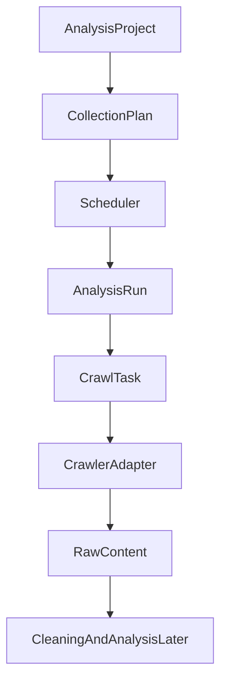

# Sustainable Crawler Architecture Implementation Plan

> **For agentic workers:** REQUIRED SUB-SKILL: Use superpowers:subagent-driven-development (recommended) or superpowers:executing-plans to implement this plan task-by-task. Steps use checkbox (`- [ ]`) syntax for tracking.

**Goal:** Build a sustainable background collection system that can continuously collect public domain data for analysis projects instead of only running one-off 100-item pulls.

**Architecture:** Keep the existing Fastify + Drizzle + SQLite + Crawlee MVP, but introduce `CollectionPlan` as the long-running collection intent and make `crawl_tasks` the durable execution log. Start with a DB-backed scheduler and conservative Crawlee adapters before introducing Redis/BullMQ; this keeps the first version deployable on the current stack while preserving a clean upgrade path.

**Tech Stack:** TypeScript, Fastify, Drizzle ORM, SQLite/libsql, Crawlee, Playwright-ready adapter contracts, React Query, Vitest.

---

## Scope And Safety Boundary

This plan intentionally designs for stable, compliant, low-frequency public data collection. It must not implement captcha bypass, platform protection evasion, stealth fingerprint spoofing, credential scraping, or automated login challenge handling. The crawler should be slow, observable, restartable, and respectful of source-specific limits.

The first implementation should not replace the whole product. It should add the missing long-running crawler layer below the current `Analysis Project / Analysis Run / Raw Content / Report` model.

## File Structure

- Modify `packages/shared/src/domain.ts`: add collection plan status, cadence, and run trigger constants.
- Modify `packages/shared/src/schemas.ts`: add DTO and input schemas for collection plans.
- Modify `packages/shared/src/schemas.test.ts`: cover plan input defaults and invalid cadence.
- Modify `packages/db/src/schema.ts`: add `collection_plans`, link `analysis_runs` and `crawl_tasks` to plans.
- Modify `packages/db/src/client.ts`: add SQLite DDL for the new table/columns.
- Create `packages/db/src/collectionPlanRepository.ts`: focused repository for plan CRUD and due-plan lookup.
- Modify `packages/db/src/index.ts`: export the new repository.
- Create `apps/api/src/services/collectionPlanService.ts`: business rules for plan creation, pause/resume, and due run generation.
- Create `apps/api/src/routes/collectionPlanRoutes.ts`: API routes for collection plan management.
- Modify `apps/api/src/routes/modules.ts`: register the new routes.
- Modify `apps/api/src/services/analysisRunService.ts`: allow runs created by a plan and pass run language through to the worker.
- Create `packages/worker/src/scheduler.ts`: loop that asks the API/service for due plans and starts small crawl batches.
- Modify `packages/worker/src/taskQueue.ts`: keep `p-queue` as local executor but expose safe queue metrics and drain behavior.
- Modify `packages/worker/src/adapters/types.ts`: add source policy and browser mode contracts.
- Create `packages/worker/src/runtime/browserRuntime.ts`: explicit Playwright/browser profile boundary for later browser-based adapters.
- Modify `apps/web/src/lib/api.ts`: add collection plan API client types.
- Create `apps/web/src/pages/CollectionPlansPanel.tsx`: minimal UI for long-running plans under Workspace or Settings.
- Test with targeted Vitest files and full `npm run typecheck`.

## Target Data Flow



`CollectionPlan` answers “what should the system keep collecting over time?”  
`AnalysisRun` answers “what happened in this specific batch?”  
`CrawlTask` answers “what worker execution did the actual collection?”

---

### Task 1: Shared Collection Plan Contracts

**Files:**
- Modify: `packages/shared/src/domain.ts`
- Modify: `packages/shared/src/schemas.ts`
- Modify: `packages/shared/src/schemas.test.ts`

- [ ] **Step 1: Add domain constants**

In `packages/shared/src/domain.ts`, add these constants after `projectStatuses`:

```ts
// WHY: collection plan 表达长期后台采集意图，避免把一次 analysis run 当成定时任务配置。
export const collectionPlanStatuses = ["active", "paused", "archived"] as const;
export const collectionCadences = ["manual", "hourly", "daily", "weekly"] as const;
export const collectionRunTriggers = ["manual", "scheduled"] as const;

export type CollectionPlanStatus = (typeof collectionPlanStatuses)[number];
export type CollectionCadence = (typeof collectionCadences)[number];
export type CollectionRunTrigger = (typeof collectionRunTriggers)[number];
```

- [ ] **Step 2: Add DTO schemas**

In `packages/shared/src/schemas.ts`, import the new constants:

```ts
import {
  analysisReportTypes,
  analysisRunStatuses,
  collectionCadences,
  collectionPlanStatuses,
  collectionRunTriggers,
  platforms,
  projectStatuses,
  taskStatuses
} from "./domain";
```

Add this block after `analysisProjectSchema`:

```ts
export const collectionPlanSchema = z.object({
  id: idSchema,
  projectId: idSchema,
  name: z.string().min(1).max(160),
  status: z.enum(collectionPlanStatuses),
  platform: z.literal("reddit"),
  includeKeywords: z.array(z.string().min(1)).min(1),
  excludeKeywords: z.array(z.string().min(1)),
  language: z.string().min(2).max(12),
  market: z.string().min(2).max(64),
  cadence: z.enum(collectionCadences),
  batchLimit: z.number().int().min(1).max(500),
  maxRunsPerDay: z.number().int().min(1).max(24),
  lastRunAt: isoDateSchema.optional(),
  nextRunAt: isoDateSchema.optional(),
  createdAt: isoDateSchema,
  updatedAt: isoDateSchema
});

export const createCollectionPlanInputSchema = z.object({
  projectId: idSchema,
  name: z.string().min(1).max(160),
  platform: z.literal("reddit").default("reddit"),
  includeKeywords: z.array(z.string().min(1)).min(1),
  excludeKeywords: z.array(z.string().min(1)).default([]),
  language: z.string().min(2).max(12),
  market: z.string().min(2).max(64),
  cadence: z.enum(collectionCadences).default("daily"),
  batchLimit: z.number().int().min(1).max(500).default(100),
  maxRunsPerDay: z.number().int().min(1).max(24).default(4)
});

export const collectionRunTriggerSchema = z.enum(collectionRunTriggers);

export type CollectionPlanDto = z.infer<typeof collectionPlanSchema>;
export type CreateCollectionPlanInput = z.infer<typeof createCollectionPlanInputSchema>;
export type CollectionRunTriggerDto = z.infer<typeof collectionRunTriggerSchema>;
```

- [ ] **Step 3: Add schema tests**

In `packages/shared/src/schemas.test.ts`, add:

```ts
import { describe, expect, it } from "vitest";
import { createCollectionPlanInputSchema } from "./schemas";

describe("createCollectionPlanInputSchema", () => {
  it("defaults conservative collection options", () => {
    const input = createCollectionPlanInputSchema.parse({
      projectId: "proj_1",
      name: "AI search monitoring",
      includeKeywords: ["AI search"],
      language: "en",
      market: "US"
    });

    expect(input.platform).toBe("reddit");
    expect(input.excludeKeywords).toEqual([]);
    expect(input.cadence).toBe("daily");
    expect(input.batchLimit).toBe(100);
    expect(input.maxRunsPerDay).toBe(4);
  });

  it("rejects unsupported cadence", () => {
    expect(() =>
      createCollectionPlanInputSchema.parse({
        projectId: "proj_1",
        name: "Bad cadence",
        includeKeywords: ["AI search"],
        language: "en",
        market: "US",
        cadence: "every_second"
      })
    ).toThrow();
  });
});
```

- [ ] **Step 4: Run tests**

Run: `npm test -- packages/shared/src/schemas.test.ts`  
Expected: PASS.

- [ ] **Step 5: Commit**

```bash
git add packages/shared/src/domain.ts packages/shared/src/schemas.ts packages/shared/src/schemas.test.ts
git commit -m "feat: add collection plan contracts"
```

---

### Task 2: Database Model For Long-Running Plans

**Files:**
- Modify: `packages/db/src/schema.ts`
- Modify: `packages/db/src/client.ts`
- Create: `packages/db/src/collectionPlanRepository.ts`
- Modify: `packages/db/src/index.ts`
- Test: `packages/db/src/collectionPlanRepository.test.ts`

- [ ] **Step 1: Add failing repository test**

Create `packages/db/src/collectionPlanRepository.test.ts`:

```ts
import { describe, expect, it } from "vitest";
import { createDb, initializeDatabase } from "./client";
import { createAnalysisProjectRepository } from "./analysisRepositories";
import { createCollectionPlanRepository } from "./collectionPlanRepository";

describe("collection plan repository", () => {
  it("creates and lists due active plans", async () => {
    const databaseUrl = "file::memory:";
    await initializeDatabase(databaseUrl);
    const db = createDb(databaseUrl);
    const projectRepo = createAnalysisProjectRepository(db);
    const planRepo = createCollectionPlanRepository(db);

    const project = await projectRepo.create({
      name: "AI search",
      goal: "Track user pain points around AI search tools",
      language: "en",
      market: "US",
      defaultLimit: 100
    });

    const plan = await planRepo.create({
      projectId: project.id,
      name: "Daily Reddit monitor",
      platform: "reddit",
      includeKeywords: ["AI search"],
      excludeKeywords: ["jobs"],
      language: "en",
      market: "US",
      cadence: "daily",
      batchLimit: 120,
      maxRunsPerDay: 4
    });

    expect(plan.status).toBe("active");
    expect(plan.nextRunAt).toBeTruthy();

    const due = await planRepo.listDue(new Date(Date.now() + 24 * 60 * 60 * 1000).toISOString(), 10);
    expect(due.map((item) => item.id)).toContain(plan.id);
  });
});
```

- [ ] **Step 2: Run test to verify it fails**

Run: `npm test -- packages/db/src/collectionPlanRepository.test.ts`  
Expected: FAIL with missing `collectionPlanRepository`.

- [ ] **Step 3: Add schema table**

In `packages/db/src/schema.ts`, add after `analysisProjects`:

```ts
// WHY: collection_plans 是长期后台采集配置；analysis_runs 只是某次执行结果，不能承载调度策略。
export const collectionPlans = sqliteTable(
  "collection_plans",
  {
    id: text("id").primaryKey(),
    projectId: text("project_id")
      .notNull()
      .references(() => analysisProjects.id),
    name: text("name").notNull(),
    status: text("status").notNull().default("active"),
    platform: text("platform").notNull().default("reddit"),
    includeKeywords: text("include_keywords", { mode: "json" }).notNull(),
    excludeKeywords: text("exclude_keywords", { mode: "json" }).notNull(),
    language: text("language").notNull(),
    market: text("market").notNull(),
    cadence: text("cadence").notNull().default("daily"),
    batchLimit: integer("batch_limit").notNull().default(100),
    maxRunsPerDay: integer("max_runs_per_day").notNull().default(4),
    lastRunAt: text("last_run_at"),
    nextRunAt: text("next_run_at"),
    ...timestamps
  },
  (table) => ({
    projectIdx: index("collection_plans_project_idx").on(table.projectId),
    statusNextRunIdx: index("collection_plans_status_next_run_idx").on(table.status, table.nextRunAt)
  })
);
```

Add optional plan links:

```ts
// In analysisRuns table:
collectionPlanId: text("collection_plan_id").references(() => collectionPlans.id),
runTrigger: text("run_trigger").notNull().default("manual"),

// In crawlTasks table:
collectionPlanId: text("collection_plan_id").references(() => collectionPlans.id),
scheduledAt: text("scheduled_at"),
```

- [ ] **Step 4: Add SQLite DDL**

In `packages/db/src/client.ts`, add after `analysis_projects` DDL:

```sql
    CREATE TABLE IF NOT EXISTS collection_plans (
      id TEXT PRIMARY KEY,
      project_id TEXT NOT NULL REFERENCES analysis_projects(id),
      name TEXT NOT NULL,
      status TEXT NOT NULL DEFAULT 'active',
      platform TEXT NOT NULL DEFAULT 'reddit',
      include_keywords TEXT NOT NULL,
      exclude_keywords TEXT NOT NULL,
      language TEXT NOT NULL,
      market TEXT NOT NULL,
      cadence TEXT NOT NULL DEFAULT 'daily',
      batch_limit INTEGER NOT NULL DEFAULT 100,
      max_runs_per_day INTEGER NOT NULL DEFAULT 4,
      last_run_at TEXT,
      next_run_at TEXT,
      created_at TEXT NOT NULL DEFAULT CURRENT_TIMESTAMP,
      updated_at TEXT NOT NULL DEFAULT CURRENT_TIMESTAMP
    );

    CREATE INDEX IF NOT EXISTS collection_plans_project_idx ON collection_plans(project_id);
    CREATE INDEX IF NOT EXISTS collection_plans_status_next_run_idx ON collection_plans(status, next_run_at);
```

Also add these columns to new local DDL:

```sql
      collection_plan_id TEXT REFERENCES collection_plans(id),
      run_trigger TEXT NOT NULL DEFAULT 'manual',
```

inside `analysis_runs`, and:

```sql
      collection_plan_id TEXT REFERENCES collection_plans(id),
      scheduled_at TEXT,
```

inside `crawl_tasks`.

- [ ] **Step 5: Implement repository**

Create `packages/db/src/collectionPlanRepository.ts`:

```ts
import { and, asc, eq, lte } from "drizzle-orm";
import type {
  CollectionCadence,
  CollectionPlanStatus,
  Platform
} from "@domain-analysis/shared";
import type { AppDb } from "./client";
import { collectionPlans } from "./schema";

export interface CreateCollectionPlanInput {
  projectId: string;
  name: string;
  platform: "reddit";
  includeKeywords: string[];
  excludeKeywords: string[];
  language: string;
  market: string;
  cadence: CollectionCadence;
  batchLimit: number;
  maxRunsPerDay: number;
}

export interface UpdateCollectionPlanInput {
  status?: CollectionPlanStatus;
  lastRunAt?: string | null;
  nextRunAt?: string | null;
}

export function createCollectionPlanRepository(db: AppDb) {
  return {
    async create(input: CreateCollectionPlanInput) {
      const now = new Date();
      const [row] = await db
        .insert(collectionPlans)
        .values({
          id: createId("plan"),
          projectId: input.projectId,
          name: input.name,
          status: "active",
          platform: input.platform,
          includeKeywords: input.includeKeywords,
          excludeKeywords: input.excludeKeywords,
          language: input.language,
          market: input.market,
          cadence: input.cadence,
          batchLimit: input.batchLimit,
          maxRunsPerDay: input.maxRunsPerDay,
          nextRunAt: computeNextRunAt(now, input.cadence)
        })
        .returning();
      return mapPlan(requireRow(row, "collection_plan_create_failed"));
    },

    async getById(id: string) {
      const [row] = await db.select().from(collectionPlans).where(eq(collectionPlans.id, id));
      return row ? mapPlan(row) : null;
    },

    async listByProject(projectId: string) {
      const rows = await db
        .select()
        .from(collectionPlans)
        .where(eq(collectionPlans.projectId, projectId))
        .orderBy(asc(collectionPlans.createdAt));
      return rows.map(mapPlan);
    },

    async listDue(nowIso: string, limit: number) {
      const rows = await db
        .select()
        .from(collectionPlans)
        .where(and(eq(collectionPlans.status, "active"), lte(collectionPlans.nextRunAt, nowIso)))
        .orderBy(asc(collectionPlans.nextRunAt))
        .limit(limit);
      return rows.map(mapPlan);
    },

    async update(id: string, input: UpdateCollectionPlanInput) {
      const [row] = await db
        .update(collectionPlans)
        .set({ ...input, updatedAt: new Date().toISOString() })
        .where(eq(collectionPlans.id, id))
        .returning();
      return row ? mapPlan(row) : null;
    }
  };
}

export function computeNextRunAt(from: Date, cadence: CollectionCadence): string | null {
  if (cadence === "manual") return null;
  const next = new Date(from);
  if (cadence === "hourly") next.setHours(next.getHours() + 1);
  if (cadence === "daily") next.setDate(next.getDate() + 1);
  if (cadence === "weekly") next.setDate(next.getDate() + 7);
  return next.toISOString();
}

function createId(prefix: string) {
  return `${prefix}_${crypto.randomUUID()}`;
}

function requireRow<TRow>(row: TRow | undefined, message: string): TRow {
  if (!row) throw new Error(message);
  return row;
}

function mapPlan(row: typeof collectionPlans.$inferSelect) {
  return {
    id: row.id,
    projectId: row.projectId,
    name: row.name,
    status: row.status as CollectionPlanStatus,
    platform: row.platform as Platform,
    includeKeywords: row.includeKeywords as string[],
    excludeKeywords: row.excludeKeywords as string[],
    language: row.language,
    market: row.market,
    cadence: row.cadence as CollectionCadence,
    batchLimit: row.batchLimit,
    maxRunsPerDay: row.maxRunsPerDay,
    lastRunAt: row.lastRunAt ?? undefined,
    nextRunAt: row.nextRunAt ?? undefined,
    createdAt: row.createdAt,
    updatedAt: row.updatedAt
  };
}
```

- [ ] **Step 6: Export repository**

In `packages/db/src/index.ts`, export:

```ts
export * from "./collectionPlanRepository";
```

- [ ] **Step 7: Run test**

Run: `npm test -- packages/db/src/collectionPlanRepository.test.ts`  
Expected: PASS.

- [ ] **Step 8: Commit**

```bash
git add packages/db/src/schema.ts packages/db/src/client.ts packages/db/src/collectionPlanRepository.ts packages/db/src/collectionPlanRepository.test.ts packages/db/src/index.ts
git commit -m "feat: persist collection plans"
```

---

### Task 3: Collection Plan Service And API

**Files:**
- Create: `apps/api/src/services/collectionPlanService.ts`
- Create: `apps/api/src/routes/collectionPlanRoutes.ts`
- Modify: `apps/api/src/routes/modules.ts`
- Test: `apps/api/src/routes/collectionPlanRoutes.test.ts`

- [ ] **Step 1: Write route test**

Create `apps/api/src/routes/collectionPlanRoutes.test.ts`:

```ts
import { describe, expect, it } from "vitest";
import { createDb, initializeDatabase } from "@domain-analysis/db";
import { buildServer } from "../server";

describe("collection plan routes", () => {
  it("creates and lists collection plans for a project", async () => {
    const databaseUrl = "file::memory:";
    await initializeDatabase(databaseUrl);
    const db = createDb(databaseUrl);
    const app = buildServer({ db });

    const runResponse = await app.inject({
      method: "POST",
      url: "/api/analysis-runs",
      payload: {
        projectName: "AI search",
        goal: "Track AI search product pain points",
        includeKeywords: ["AI search"],
        excludeKeywords: [],
        language: "en",
        market: "US",
        limit: 100
      }
    });
    const run = runResponse.json();

    const createResponse = await app.inject({
      method: "POST",
      url: "/api/collection-plans",
      payload: {
        projectId: run.projectId,
        name: "Daily Reddit monitor",
        includeKeywords: ["AI search"],
        excludeKeywords: ["jobs"],
        language: "en",
        market: "US",
        cadence: "daily",
        batchLimit: 100,
        maxRunsPerDay: 4
      }
    });

    expect(createResponse.statusCode).toBe(201);
    expect(createResponse.json().status).toBe("active");

    const listResponse = await app.inject({
      method: "GET",
      url: `/api/projects/${run.projectId}/collection-plans`
    });

    expect(listResponse.statusCode).toBe(200);
    expect(listResponse.json()).toHaveLength(1);
  });
});
```

- [ ] **Step 2: Run test to verify it fails**

Run: `npm test -- apps/api/src/routes/collectionPlanRoutes.test.ts`  
Expected: FAIL with missing route.

- [ ] **Step 3: Implement service**

Create `apps/api/src/services/collectionPlanService.ts`:

```ts
import {
  computeNextRunAt,
  createAnalysisProjectRepository,
  createCollectionPlanRepository,
  type AppDb
} from "@domain-analysis/db";
import type { CollectionCadence } from "@domain-analysis/shared";

export function createCollectionPlanService(db: AppDb) {
  const projectRepo = createAnalysisProjectRepository(db);
  const planRepo = createCollectionPlanRepository(db);

  return {
    async createPlan(input: {
      projectId: string;
      name: string;
      platform: "reddit";
      includeKeywords: string[];
      excludeKeywords: string[];
      language: string;
      market: string;
      cadence: CollectionCadence;
      batchLimit: number;
      maxRunsPerDay: number;
    }) {
      const project = await projectRepo.getById(input.projectId);
      if (!project) throw Object.assign(new Error("project_not_found"), { statusCode: 404 });
      return planRepo.create(input);
    },

    async listByProject(projectId: string) {
      return planRepo.listByProject(projectId);
    },

    async pausePlan(id: string) {
      return planRepo.update(id, { status: "paused" });
    },

    async resumePlan(id: string) {
      const nextRunAt = computeNextRunAt(new Date(), "daily");
      return planRepo.update(id, { status: "active", nextRunAt });
    }
  };
}
```

- [ ] **Step 4: Implement routes**

Create `apps/api/src/routes/collectionPlanRoutes.ts`:

```ts
import type { FastifyInstance } from "fastify";
import { createCollectionPlanInputSchema } from "@domain-analysis/shared";
import type { AppDb } from "@domain-analysis/db";
import { createCollectionPlanService } from "../services/collectionPlanService";

export async function registerCollectionPlanRoutes(app: FastifyInstance, db: AppDb) {
  const service = createCollectionPlanService(db);

  app.post("/api/collection-plans", async (request, reply) => {
    const input = createCollectionPlanInputSchema.parse(request.body);
    const plan = await service.createPlan(input);
    return reply.code(201).send(plan);
  });

  app.get("/api/projects/:projectId/collection-plans", async (request) => {
    const params = request.params as { projectId: string };
    return service.listByProject(params.projectId);
  });

  app.post("/api/collection-plans/:id/pause", async (request) => {
    const params = request.params as { id: string };
    return service.pausePlan(params.id);
  });

  app.post("/api/collection-plans/:id/resume", async (request) => {
    const params = request.params as { id: string };
    return service.resumePlan(params.id);
  });
}
```

- [ ] **Step 5: Register routes**

In `apps/api/src/routes/modules.ts`, import and register:

```ts
import { registerCollectionPlanRoutes } from "./collectionPlanRoutes";

await registerCollectionPlanRoutes(app, db);
```

- [ ] **Step 6: Run test**

Run: `npm test -- apps/api/src/routes/collectionPlanRoutes.test.ts`  
Expected: PASS.

- [ ] **Step 7: Commit**

```bash
git add apps/api/src/services/collectionPlanService.ts apps/api/src/routes/collectionPlanRoutes.ts apps/api/src/routes/modules.ts apps/api/src/routes/collectionPlanRoutes.test.ts
git commit -m "feat: add collection plan api"
```

---

### Task 4: Scheduled Batch Creation

**Files:**
- Modify: `packages/db/src/analysisRepositories.ts`
- Modify: `apps/api/src/services/analysisRunService.ts`
- Modify: `apps/api/src/services/collectionPlanService.ts`
- Test: `apps/api/src/services/collectionPlanService.test.ts`

- [ ] **Step 1: Write service test**

Create `apps/api/src/services/collectionPlanService.test.ts`:

```ts
import { describe, expect, it } from "vitest";
import { createDb, initializeDatabase } from "@domain-analysis/db";
import { createAnalysisRunService } from "./analysisRunService";
import { createCollectionPlanService } from "./collectionPlanService";

describe("collection plan scheduled runs", () => {
  it("creates a scheduled analysis run from a due plan", async () => {
    const databaseUrl = "file::memory:";
    await initializeDatabase(databaseUrl);
    const db = createDb(databaseUrl);
    const runService = createAnalysisRunService(db);
    const planService = createCollectionPlanService(db);

    const run = await runService.createRun({
      projectName: "AI search",
      goal: "Track AI search product pain points",
      includeKeywords: ["AI search"],
      excludeKeywords: [],
      language: "en",
      market: "US",
      limit: 100
    });

    const plan = await planService.createPlan({
      projectId: run.projectId,
      name: "Daily Reddit monitor",
      platform: "reddit",
      includeKeywords: ["AI search"],
      excludeKeywords: [],
      language: "en",
      market: "US",
      cadence: "daily",
      batchLimit: 100,
      maxRunsPerDay: 4
    });

    const scheduled = await planService.createScheduledRun(plan.id);

    expect(scheduled.collectionPlanId).toBe(plan.id);
    expect(scheduled.runTrigger).toBe("scheduled");
    expect(scheduled.includeKeywords).toEqual(["AI search"]);
  });
});
```

- [ ] **Step 2: Run test to verify it fails**

Run: `npm test -- apps/api/src/services/collectionPlanService.test.ts`  
Expected: FAIL with missing `createScheduledRun`.

- [ ] **Step 3: Extend repository input and mapping**

In `packages/db/src/analysisRepositories.ts`, extend `CreateAnalysisRunInput`:

```ts
collectionPlanId?: string;
runTrigger?: "manual" | "scheduled";
```

Set values in `create`:

```ts
collectionPlanId: input.collectionPlanId,
runTrigger: input.runTrigger ?? "manual",
```

Return these fields from `mapRun`:

```ts
collectionPlanId: row.collectionPlanId ?? undefined,
runTrigger: row.runTrigger as "manual" | "scheduled",
```

- [ ] **Step 4: Update service createRun input**

In `apps/api/src/services/analysisRunService.ts`, extend `createRun` input:

```ts
collectionPlanId?: string;
runTrigger?: "manual" | "scheduled";
```

Pass these to `runRepo.create`:

```ts
collectionPlanId: input.collectionPlanId,
runTrigger: input.runTrigger ?? "manual",
```

- [ ] **Step 5: Implement scheduled run creation**

In `apps/api/src/services/collectionPlanService.ts`, import `createAnalysisRunRepository` and add:

```ts
const runRepo = createAnalysisRunRepository(db);
```

Add method:

```ts
async createScheduledRun(planId: string) {
  const plan = await planRepo.getById(planId);
  if (!plan) throw Object.assign(new Error("collection_plan_not_found"), { statusCode: 404 });
  if (plan.status !== "active") {
    throw Object.assign(new Error("collection_plan_not_active"), { statusCode: 400 });
  }

  // WHY: 每次调度生成一个小批次 run，避免长期任务没有清晰的内容和报告上下文。
  const run = await runRepo.create({
    projectId: plan.projectId,
    name: `${plan.name} - ${new Date().toISOString().slice(0, 10)}`,
    goal: `Scheduled collection for ${plan.name}`,
    includeKeywords: plan.includeKeywords,
    excludeKeywords: plan.excludeKeywords,
    language: plan.language,
    market: plan.market,
    limit: plan.batchLimit,
    collectionPlanId: plan.id,
    runTrigger: "scheduled"
  });

  await planRepo.update(plan.id, {
    lastRunAt: new Date().toISOString(),
    nextRunAt: computeNextRunAt(new Date(), plan.cadence)
  });

  return run;
}
```

- [ ] **Step 6: Run test**

Run: `npm test -- apps/api/src/services/collectionPlanService.test.ts`  
Expected: PASS.

- [ ] **Step 7: Commit**

```bash
git add packages/db/src/analysisRepositories.ts apps/api/src/services/analysisRunService.ts apps/api/src/services/collectionPlanService.ts apps/api/src/services/collectionPlanService.test.ts
git commit -m "feat: create scheduled analysis runs"
```

---

### Task 5: Background Scheduler

**Files:**
- Create: `packages/worker/src/scheduler.ts`
- Modify: `packages/worker/src/index.ts`
- Modify: `apps/api/src/services/collectionPlanService.ts`
- Test: `packages/worker/src/scheduler.test.ts`

- [ ] **Step 1: Write scheduler test**

Create `packages/worker/src/scheduler.test.ts`:

```ts
import { describe, expect, it, vi } from "vitest";
import { runSchedulerTick } from "./scheduler";

describe("runSchedulerTick", () => {
  it("creates and starts one scheduled run per due plan", async () => {
    const createScheduledRun = vi.fn(async (planId: string) => ({ id: `run_${planId}` }));
    const startRun = vi.fn(async () => undefined);
    const listDuePlans = vi.fn(async () => [{ id: "plan_1" }, { id: "plan_2" }]);

    const result = await runSchedulerTick({
      listDuePlans,
      createScheduledRun,
      startRun,
      nowIso: "2026-05-07T00:00:00.000Z",
      limit: 10
    });

    expect(result.createdRuns).toBe(2);
    expect(startRun).toHaveBeenCalledWith("run_plan_1");
    expect(startRun).toHaveBeenCalledWith("run_plan_2");
  });
});
```

- [ ] **Step 2: Run test to verify it fails**

Run: `npm test -- packages/worker/src/scheduler.test.ts`  
Expected: FAIL with missing `scheduler`.

- [ ] **Step 3: Implement scheduler core**

Create `packages/worker/src/scheduler.ts`:

```ts
export interface SchedulerTickDeps {
  listDuePlans(nowIso: string, limit: number): Promise<Array<{ id: string }>>;
  createScheduledRun(planId: string): Promise<{ id: string }>;
  startRun(runId: string): Promise<unknown>;
  nowIso: string;
  limit: number;
}

export async function runSchedulerTick(deps: SchedulerTickDeps) {
  const duePlans = await deps.listDuePlans(deps.nowIso, deps.limit);
  let createdRuns = 0;

  for (const plan of duePlans) {
    const run = await deps.createScheduledRun(plan.id);
    await deps.startRun(run.id);
    createdRuns += 1;
  }

  return { checkedPlans: duePlans.length, createdRuns };
}

export interface SchedulerLoopOptions {
  intervalMs: number;
  stopSignal?: AbortSignal;
  tick(): Promise<unknown>;
  onError(error: unknown): void;
}

export function startSchedulerLoop(options: SchedulerLoopOptions) {
  const timer = setInterval(() => {
    if (options.stopSignal?.aborted) {
      clearInterval(timer);
      return;
    }
    void options.tick().catch(options.onError);
  }, options.intervalMs);

  return () => clearInterval(timer);
}
```

- [ ] **Step 4: Export scheduler**

In `packages/worker/src/index.ts`, add:

```ts
export * from "./scheduler";
```

- [ ] **Step 5: Add service helper**

In `apps/api/src/services/collectionPlanService.ts`, add:

```ts
async listDuePlans(nowIso: string, limit: number) {
  return planRepo.listDue(nowIso, limit);
}
```

- [ ] **Step 6: Run scheduler test**

Run: `npm test -- packages/worker/src/scheduler.test.ts`  
Expected: PASS.

- [ ] **Step 7: Commit**

```bash
git add packages/worker/src/scheduler.ts packages/worker/src/scheduler.test.ts packages/worker/src/index.ts apps/api/src/services/collectionPlanService.ts
git commit -m "feat: add collection scheduler core"
```

---

### Task 6: Conservative Adapter Policy And Browser Boundary

**Files:**
- Modify: `packages/worker/src/adapters/types.ts`
- Create: `packages/worker/src/runtime/browserRuntime.ts`
- Test: `packages/worker/src/runtime/browserRuntime.test.ts`

- [ ] **Step 1: Add runtime test**

Create `packages/worker/src/runtime/browserRuntime.test.ts`:

```ts
import { describe, expect, it } from "vitest";
import { createBrowserRuntimeConfig } from "./browserRuntime";

describe("browser runtime config", () => {
  it("defaults to explicit headless runtime without stealth behavior", () => {
    const config = createBrowserRuntimeConfig({});

    expect(config.mode).toBe("headless");
    expect(config.userDataDir).toBeUndefined();
    expect(config.allowChallengeAutomation).toBe(false);
  });

  it("supports local profile mode when userDataDir is provided", () => {
    const config = createBrowserRuntimeConfig({
      BROWSER_MODE: "local_profile",
      BROWSER_USER_DATA_DIR: "/tmp/domain-analysis-browser"
    });

    expect(config.mode).toBe("local_profile");
    expect(config.userDataDir).toBe("/tmp/domain-analysis-browser");
  });
});
```

- [ ] **Step 2: Run test to verify it fails**

Run: `npm test -- packages/worker/src/runtime/browserRuntime.test.ts`  
Expected: FAIL with missing runtime file.

- [ ] **Step 3: Add adapter policy contracts**

In `packages/worker/src/adapters/types.ts`, add:

```ts
export type BrowserMode = "none" | "headless" | "local_profile";

export interface SourceCollectionPolicy {
  browserMode: BrowserMode;
  respectRobotsTxt: boolean;
  maxConcurrency: number;
  maxRequestsPerMinute: number;
  maxRequestRetries: number;
  sameDomainDelaySecs: number;
}

export const defaultConservativeSourcePolicy: SourceCollectionPolicy = {
  browserMode: "none",
  respectRobotsTxt: true,
  maxConcurrency: 1,
  maxRequestsPerMinute: 6,
  maxRequestRetries: 1,
  sameDomainDelaySecs: 10
};
```

- [ ] **Step 4: Add browser runtime config**

Create `packages/worker/src/runtime/browserRuntime.ts`:

```ts
import type { BrowserMode } from "../adapters/types";

export interface BrowserRuntimeConfig {
  mode: Exclude<BrowserMode, "none">;
  userDataDir?: string;
  allowChallengeAutomation: false;
}

export function createBrowserRuntimeConfig(env: NodeJS.ProcessEnv): BrowserRuntimeConfig {
  const mode = env.BROWSER_MODE === "local_profile" ? "local_profile" : "headless";
  const userDataDir = mode === "local_profile" ? env.BROWSER_USER_DATA_DIR : undefined;

  if (mode === "local_profile" && !userDataDir) {
    throw new Error("missing_BROWSER_USER_DATA_DIR");
  }

  return {
    mode,
    userDataDir,
    // WHY: 登录、验证码、二次验证必须由用户人工完成；系统只复用明确授权的本地 profile。
    allowChallengeAutomation: false
  };
}
```

- [ ] **Step 5: Run test**

Run: `npm test -- packages/worker/src/runtime/browserRuntime.test.ts`  
Expected: PASS.

- [ ] **Step 6: Commit**

```bash
git add packages/worker/src/adapters/types.ts packages/worker/src/runtime/browserRuntime.ts packages/worker/src/runtime/browserRuntime.test.ts
git commit -m "feat: define conservative browser runtime"
```

---

### Task 7: UI For Collection Plans

**Files:**
- Modify: `apps/web/src/lib/api.ts`
- Create: `apps/web/src/pages/CollectionPlansPanel.tsx`
- Modify: `apps/web/src/pages/WorkspacePage.tsx`
- Test: `apps/web/src/lib/api.test.ts`

- [ ] **Step 1: Add API client test**

In `apps/web/src/lib/api.test.ts`, add:

```ts
import { describe, expect, it } from "vitest";
import { buildQueryString } from "./api";

describe("collection plan api helpers", () => {
  it("keeps empty query strings empty", () => {
    expect(buildQueryString({})).toBe("");
  });
});
```

- [ ] **Step 2: Add API types and functions**

In `apps/web/src/lib/api.ts`, add:

```ts
export interface CollectionPlan {
  id: string;
  projectId: string;
  name: string;
  status: "active" | "paused" | "archived";
  platform: "reddit";
  includeKeywords: string[];
  excludeKeywords: string[];
  language: string;
  market: string;
  cadence: "manual" | "hourly" | "daily" | "weekly";
  batchLimit: number;
  maxRunsPerDay: number;
  lastRunAt?: string;
  nextRunAt?: string;
  createdAt: string;
  updatedAt: string;
}

export interface CreateCollectionPlanInput {
  projectId: string;
  name: string;
  includeKeywords: string[];
  excludeKeywords: string[];
  language: string;
  market: string;
  cadence: "manual" | "hourly" | "daily" | "weekly";
  batchLimit: number;
  maxRunsPerDay: number;
}

export async function fetchProjectCollectionPlans(projectId: string) {
  return apiJson<CollectionPlan[]>(`/api/projects/${projectId}/collection-plans`);
}

export async function createCollectionPlan(input: CreateCollectionPlanInput) {
  return apiJson<CollectionPlan>("/api/collection-plans", {
    method: "POST",
    body: JSON.stringify(input)
  });
}
```

- [ ] **Step 3: Add minimal panel**

Create `apps/web/src/pages/CollectionPlansPanel.tsx`:

```tsx
import { useQuery } from "@tanstack/react-query";
import { fetchProjectCollectionPlans } from "../lib/api";
import { formatDateTime } from "../lib/format";

export function CollectionPlansPanel({ projectId }: { projectId: string }) {
  const plansQuery = useQuery({
    queryKey: ["collection-plans", projectId],
    queryFn: () => fetchProjectCollectionPlans(projectId),
    enabled: Boolean(projectId)
  });

  if (plansQuery.isLoading) return <p className="text-sm text-muted">Loading collection plans...</p>;

  const plans = plansQuery.data ?? [];
  if (plans.length === 0) {
    return (
      <div className="rounded-lg border border-line p-4 text-sm text-muted">
        No background collection plans yet. Create one after the project workflow is enabled.
      </div>
    );
  }

  return (
    <div className="flex flex-col gap-3">
      {plans.map((plan) => (
        <div key={plan.id} className="rounded-lg border border-line p-4">
          <div className="flex items-center justify-between">
            <h3 className="text-sm font-medium">{plan.name}</h3>
            <span className="rounded-full bg-panel px-2 py-0.5 text-xs">{plan.status}</span>
          </div>
          <p className="mt-2 text-xs text-muted">
            {plan.platform} · {plan.cadence} · {plan.batchLimit} per batch
          </p>
          <p className="mt-1 text-xs text-muted">
            Next run: {plan.nextRunAt ? formatDateTime(plan.nextRunAt) : "manual only"}
          </p>
        </div>
      ))}
    </div>
  );
}
```

- [ ] **Step 4: Wire into Workspace**

In `apps/web/src/pages/WorkspacePage.tsx`, render `CollectionPlansPanel` near the selected run/project summary when `selectedRun?.projectId` exists:

```tsx
<CollectionPlansPanel projectId={selectedRun.projectId} />
```

Also import:

```ts
import { CollectionPlansPanel } from "./CollectionPlansPanel";
```

- [ ] **Step 5: Run tests and typecheck**

Run: `npm test -- apps/web/src/lib/api.test.ts`  
Expected: PASS.

Run: `npm run typecheck:web`  
Expected: PASS.

- [ ] **Step 6: Commit**

```bash
git add apps/web/src/lib/api.ts apps/web/src/lib/api.test.ts apps/web/src/pages/CollectionPlansPanel.tsx apps/web/src/pages/WorkspacePage.tsx
git commit -m "feat: show collection plans in workspace"
```

---

### Task 8: Verification And Rollout Notes

**Files:**
- Modify: `docs/superpowers/plans/2026-05-07-sustainable-crawler-architecture.md`

- [ ] **Step 1: Run full verification**

Run: `npm test`  
Expected: PASS.

Run: `npm run typecheck`  
Expected: PASS.

Run: `npm run build`  
Expected: PASS.

- [ ] **Step 2: Manual smoke test**

Run the app:

```bash
npm run dev
```

Expected:

- API health returns OK.
- Workspace still creates a manual analysis run.
- A collection plan can be created through the API.
- `GET /api/projects/:projectId/collection-plans` returns the plan.
- Scheduler core tests prove due plans can produce scheduled runs.

- [ ] **Step 3: Rollout constraints**

Record these constraints in the PR description:

- This phase keeps `p-queue` for local execution and uses DB state for durable plan intent.
- This phase does not implement high-scale distributed crawling.
- This phase does not implement captcha bypass, stealth automation, or login challenge automation.
- Browser runtime is only a safe boundary for future Playwright adapters.
- Redis/BullMQ should be evaluated after this DB-backed scheduler proves the product flow.

- [ ] **Step 4: Commit final doc updates**

```bash
git add docs/superpowers/plans/2026-05-07-sustainable-crawler-architecture.md
git commit -m "docs: add sustainable crawler architecture plan"
```

---

## Self-Review

- Spec coverage: The plan covers long-running collection intent, scheduled run generation, durable DB state, conservative worker policy, browser runtime boundary, minimal UI, and verification.
- Placeholder scan: No task relies on vague future work. Browser-based crawling is intentionally bounded as a runtime contract, not implemented as stealth automation.
- Type consistency: `CollectionPlan`, `collectionPlanId`, `runTrigger`, `cadence`, `batchLimit`, and `maxRunsPerDay` are used consistently across shared, DB, API, worker, and web layers.

## Execution Handoff

Plan complete and saved to `docs/superpowers/plans/2026-05-07-sustainable-crawler-architecture.md`. Two execution options:

**1. Subagent-Driven (recommended)** - Dispatch a fresh subagent per task, review between tasks, fast iteration.

**2. Inline Execution** - Execute tasks in this session using executing-plans, batch execution with checkpoints.

Which approach?
